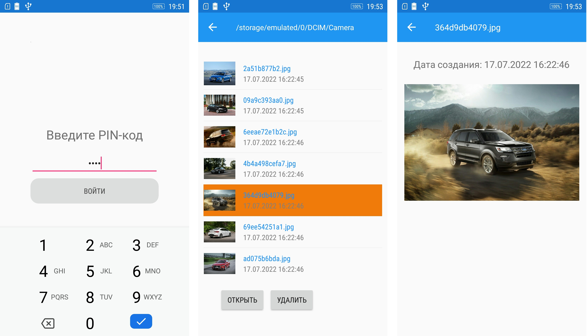

###  Модуль 40 (часть 4). Проект на Xamarin. Мобильное приложение для просмотра картинок

#### Техническое задание

1. Приложение должно содержать три экрана: экран PIN-кода, экран со списком изображений и экран просмотра конкретного изображения.
2. Экран PIN-кода при первом запуске должен предлагать пользователю установить PIN-код из четырех символов. После первичной установки PIN-кода пользователю должен открываться экран со списком изображений.
3. Если приложение запускается не первый раз, то экран PIN-кода должен запрашивать у пользователя установленный ранее PIN-код. После верного ввода PIN-кода пользователю должен открываться экран со списком изображений.
4. Механизм хранения PIN-кода вы можете реализовать как хотите, но ключевое требование: PIN должен сохраняться при перезапуске приложения.
5. Экран со списком изображений должен содержать галерею изображений (загруженных из папки Camera), точно так же, как содержит приложение Photos со скриншота выше. Но вдобавок к самим изображениям рядом с ними в списке должны также выводиться их имена. Стиль галереи (большие иконки или маленькие, горизонтальные или вертикальные, и т.д.) — на ваш выбор. 
6. Внизу экрана со списком изображений должны быть две кнопки: «Открыть» и «Удалить».
7. Кнопка «Открыть» должна открывать выбранное изображение во весь экран (отдельный экран просмотра конкретного изображения), и на этом экране рядом с фото должна стоять подпись, когда оно сделано.
8. Кнопка «Удалить» должна удалять изображение из галереи и файловой системы устройства. При удалении пользователь не должен переходить на другую страницу, а страница со списком изображений (на которой он находится) должна автоматически убирать удаленное изображение из списка. 
